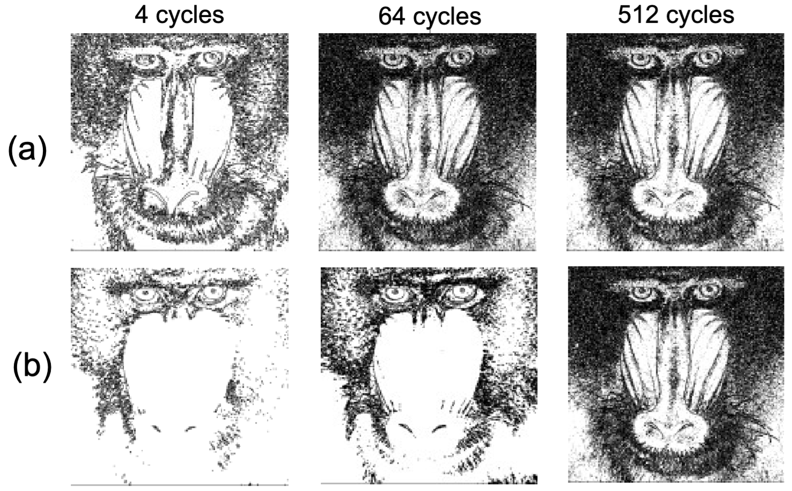

现代处理器正面临「工艺放缓」与「算力需求暴涨」的双重挤压——尤其是机器学习与 AI 负载的增长远超摩尔定律能供给的速度。
一个自然的思路是：既然很多应用**并不要求 100% 精确**（例如图像里几个像素的误差、神经网络几个百分点的精度损失，往往可以接受），
那就换一种计算范式，用近似性换取面积与能效。

随机计算（Stochastic Computing, SC）正是这样一条路：把数字编码成一条比特流，比特 1 出现的概率就是这个数本身。
例如，比特流 `10110101` 里有 5 个 1，长度为 8，因此它表示的数值是 $5/8$。
在这种表示下，乘法是单个 `AND` 门，符号乘法是单个 `XNOR` 门——**算术运算被降维成了普通逻辑门**。

## 随机计算的特点

1. **逻辑运算单元简单**

   2比特的二进制乘法器总共需要8个逻辑门:

   

   而随机计算的乘法器只需要一个 `AND` 门：

   

2. **计算存在误差**

   如果两条随机比特流由同一个随机源派生、或周期模式恰好对齐，误差会相干叠加。
   比如下面这条：两条**完全相同**的随机比特流过同一个 `AND` 门，结果为 1/2，而不是期望的 1/4：

   

   如何生成多条「统计独立」的比特流，本身就是 SC 设计里一个大课题。

3. **天然的错误容忍**

   二进制里 bit 的**权重**天差地别——符号位或高位翻转，数值可能面目全非。
   而 SC 比特流里**每个 bit 权重相等**：个别比特被噪声翻转，编码值只发生 $O(1/N)$ 的扰动。
   这让 SC 对制造缺陷、工艺偏差和软错误天然鲁棒。
   <!-- 这也是它和存内计算（processing-in-memory）等近似计算范式共享的底层逻辑。 -->

   

4. 渐进精度

   SC 在时间维度上串行计算，对于 $n$ 比特的电路，它需要 $2^n$ 个周期才能收敛到期望值。
   但是 SC 具有**渐进精度**（progressive precision）的性质：计算准确度和比特流长度成正比。
   如果在时间 $t$，计算的结果已经满足应用的精度预算，就可以提前终止计算，节省延迟和能耗。

   
   _在边缘检测应用里，一个渐进精度好的 SC 电路 (a) 64 个周期后的输出就足够好，而渐进精度差的要 512 个周期——同样的精度预算下，延迟差 8 倍。_

## 随机计算：用概率表示数字

### 无符号与双极性编码

SC 用一条“随机比特流” $X$ 表示一个实数，数值由 1 的比例 $P(X = 1)$ 决定。

SC 有两种基本编码：

| 编码               | 映射                  | 取值范围  |
| ------------------ | --------------------- | --------- |
| Unipolar（无符号） | $x = P(X = 1)$        | $[0, 1]$  |
| Bipolar（双极性）  | $x = 2\,P(X = 1) - 1$ | $[-1, 1]$ |

例如 4 比特流 `1010` 在 unipolar 下编码 $0.5$，在 bipolar 下编码 $0$。
要表示范围外的数值，先做 pre-scaling 归一化即可。

### 逻辑门即算术单元

设两条**互相独立**的比特流 $X, Y$ 的密度为 $p, q$，则：

| SC 运算             | 对应逻辑门 | 输出密度               | 备注                            |
| ------------------- | ---------- | ---------------------- | ------------------------------- |
| 乘法                | `AND`      | $P(X \wedge Y) = p\,q$ | SC 最经典的性质                 |
| 加法（含进位项）    | `OR`       | $p + q - p\,q$         |                                 |
| 符号乘法（bipolar） | `XNOR`     | $1 - p - q + 2p\,q$    | $x \cdot y = 4pq - 2p - 2q + 1$ |
| 取负                | `NOT`      | $1 - p$                |                                 |

神经网络推理里最贵的乘累加（MAC）单元，在 SC 域里退化为一级逻辑门，这就是 SC 面积与能效优势的来源。
加法则有两种路线：Mux-based adder 留在 SC 域（面积小但精度低），或用累积并行计数器（APC）把比特流累加后直接输出二进制
（精确，但引入了 SC→BC 转换）。

## 结语

随机计算把「表示」和「运算」重新配对：数字不是确定的位串，而是概率流；算术不需要专门单元，普通逻辑门就够用。它不追求精确，而是回答另一个问题——**当应用只需要「足够准」时，一个 MAC 最少需要多少晶体管、多少能量？** 对神经网络推理这类负载，答案比定点实现低一到两个数量级，而且噪声容忍性让它和存内计算、神经形态硬件这些「不完美硬件」格外合拍。

它大概率不会取代 von Neumann 主计算路径，但在「精确性过剩」的边缘计算角落，这种把随机性当资源而非噪声的范式正找到合适的位置——以上正是我博士课题在研究的事，后续有进展会陆续写出来。
